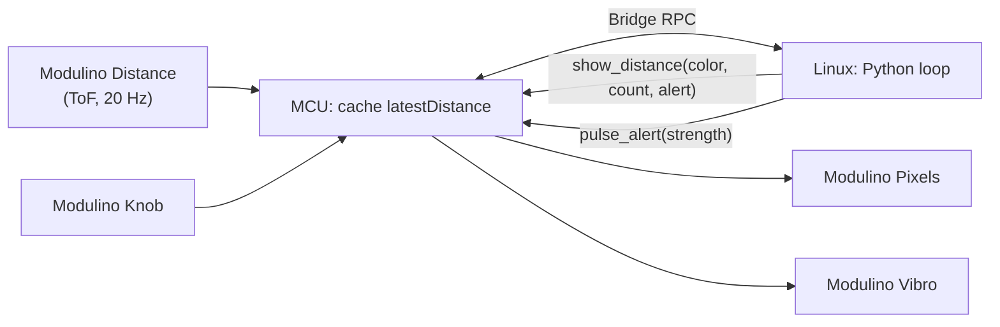

# QC UNO Q Workshop 102: Proximity Lamp

Build a configurable proximity alert lamp using a Time-of-Flight distance sensor. As an object moves
closer, the Pixel LEDs light up in a color gradient from green to red and a Vibro haptic pulse fires
the moment the object crosses your chosen alert threshold. You will learn how ToF sensors work, how
to map a continuous sensor range to a visual display, and how to detect threshold crossings using
edge detection rather than polling.

## Session Prerequisites

1. Install [Arduino App Lab](https://www.arduino.cc/en/software/#app-lab-section).
2. Clone this repository using `git clone https://github.com/aaishikasb/uno-q-workshops.git` in your terminal.

## Hardware Setup (Provided On-site)

### Required Hardware

- Arduino UNO Q
- Modulino Distance (VL53L4CD)
- Modulino Pixels
- Modulino Vibro
- Modulino Knob
- 4 Qwiic cables
- USB-C cable

### Wiring

Chain the Modulinos with Qwiic in this order:

```text
UNO Q Qwiic -> Modulino Distance -> Modulino Pixels -> Modulino Vibro -> Modulino Knob
```

> [!NOTE]
> Modulinos on UNO Q can behave differently depending on the order they are connected. Use the chain above to match the tested configuration.

Point the Distance sensor window toward open space — it needs a clear line of sight to measure correctly.

After connecting all the Modulinos, connect the UNO Q to your computer with USB-C.

## App Lab Setup

1. Open Arduino App Lab.
2. Select your UNO Q board.
3. If the `Updates` modal pops up, **DO NOT** proceed with updating board firmware.
4. Open **My Apps**.
5. Import or upload the `.zip` file in this repository.
6. Open the imported `UNO Q Proximity Lamp` app in App Lab.
7. Confirm the files are present:
   - `app.yaml`
   - `python/main.py`
   - `sketch/sketch.ino`
   - `sketch/sketch.yaml`
8. Click `Run` on the top-right corner.

App Lab will compile and flash the MCU sketch, then start the Python runtime on the UNO Q Linux side. The Vibro pulses once during startup.

## How The Demo Works



- The MCU polls the Distance sensor at 20 Hz in `loop()` and caches the latest reading.
- The MCU exposes `read_distance()` and `read_knob()` over Bridge.
- Python reads distance every 50 ms, maps it to a color code and pixel count, and calls `show_distance()`.
- Python maps the knob position to an alert threshold (50–500 mm) and detects when the object crosses into the alert zone.
- The haptic fires once on the `outside → inside` transition — not continuously while inside.

**Distance bands:**

| Distance | Color | Meaning |
|---|---|---|
| > 1000 mm | Green | Far |
| 300–1000 mm | Yellow | Mid |
| 150–300 mm | Orange | Close |
| < 150 mm | Red | Very close |

## Files

- `workshop-app/`: App Lab project source
- `workshop-app/python/main.py`: distance reading, threshold logic, and edge detection
- `workshop-app/sketch/sketch.ino`: ToF polling loop, Pixel gradient, and Vibro pulse
- `workshop-app.zip`: importable App Lab file

## Sources

- Arduino UNO Q hardware docs: https://docs.arduino.cc/hardware/uno-q
- Arduino Bridge guide: https://docs.arduino.cc/software/app-lab/bridge/get-started-with-bridge
- Arduino Bridge API: https://docs.arduino.cc/software/app-lab/bridge/bridge-api
- Arduino App structure: https://docs.arduino.cc/software/app-lab/apps/about-apps
- Arduino Modulino library: https://docs.arduino.cc/libraries/arduino_modulino
