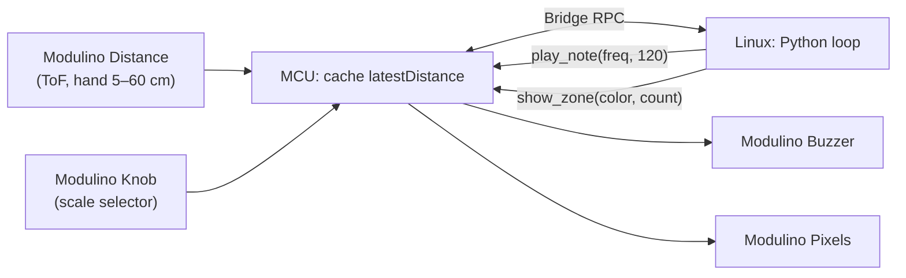

# QC UNO Q Workshop 103: Theremin Synth

Play notes by waving your hand over the Distance sensor — no buttons, no touching. The VL53L4CD ToF sensor measures how far your hand is from the board (5–60 cm) and Python maps that distance to a note on the selected scale. The Pixels show pitch as a color gradient (blue = low/far, red = high/close). Turn the Knob to cycle between pentatonic, major, and chromatic scales.

## Session Prerequisites

1. Install [Arduino App Lab](https://www.arduino.cc/en/software/#app-lab-section).
2. Clone this repository using `git clone https://github.com/aaishikasb/uno-q-workshops.git` in your terminal.

## Hardware Setup (Provided On-site)

### Required Hardware

- Arduino UNO Q
- Modulino Distance (VL53L4CD)
- Modulino Pixels
- Modulino Buzzer
- Modulino Knob
- 4 Qwiic cables
- USB-C cable

### Wiring

Chain the Modulinos with Qwiic in this order:

```text
UNO Q Qwiic -> Modulino Distance -> Modulino Pixels -> Modulino Buzzer -> Modulino Knob
```

> [!NOTE]
> Modulinos on UNO Q can behave differently depending on the order they are connected. Use the chain above to match the tested configuration.

Aim the Distance sensor upward or forward so your hand can pass over it 5–60 cm away.

After connecting all the Modulinos, connect the UNO Q to your computer with USB-C.

## App Lab Setup

1. Open Arduino App Lab.
2. Select your UNO Q board.
3. If the `Updates` modal pops up, **DO NOT** proceed with updating board firmware.
4. Open **My Apps**.
5. Import or upload the `.zip` file in this repository.
6. Open the imported `UNO Q Theremin Synth` app in App Lab.
7. Confirm the files are present:
   - `app.yaml`
   - `python/main.py`
   - `sketch/sketch.ino`
   - `sketch/sketch.yaml`
8. Click `Run` on the top-right corner.

App Lab will compile and flash the MCU sketch, then start the Python runtime on the UNO Q Linux side.

## How The Demo Works



- The MCU polls the Distance sensor and exposes `read_distance()` and `read_knob()` over Bridge.
- Python maps distance to a note index within the active scale (pentatonic, major, or chromatic).
- Bringing your hand closer raises the pitch — matching theremin convention (50 mm = highest note, 600 mm = lowest).
- Scale quantization rounds distance to the nearest note index, preventing dissonant in-between frequencies.
- The note only updates when the rounded index changes, so small hand tremor does not cause rapid note switching.
- Knob position selects the active scale: 0–33 = pentatonic, 34–66 = major, 67–100 = chromatic.

## Files

- `workshop-app/`: App Lab project source
- `workshop-app/python/main.py`: scale tables, distance-to-note mapping, and hysteresis
- `workshop-app/sketch/sketch.ino`: Distance read, Buzzer and Pixels handlers
- `workshop-app.zip`: importable App Lab file

## Sources

- Arduino UNO Q hardware docs: https://docs.arduino.cc/hardware/uno-q
- Arduino Bridge guide: https://docs.arduino.cc/software/app-lab/bridge/get-started-with-bridge
- Arduino Bridge API: https://docs.arduino.cc/software/app-lab/bridge/bridge-api
- Arduino App structure: https://docs.arduino.cc/software/app-lab/apps/about-apps
- Arduino Modulino library: https://docs.arduino.cc/libraries/arduino_modulino
