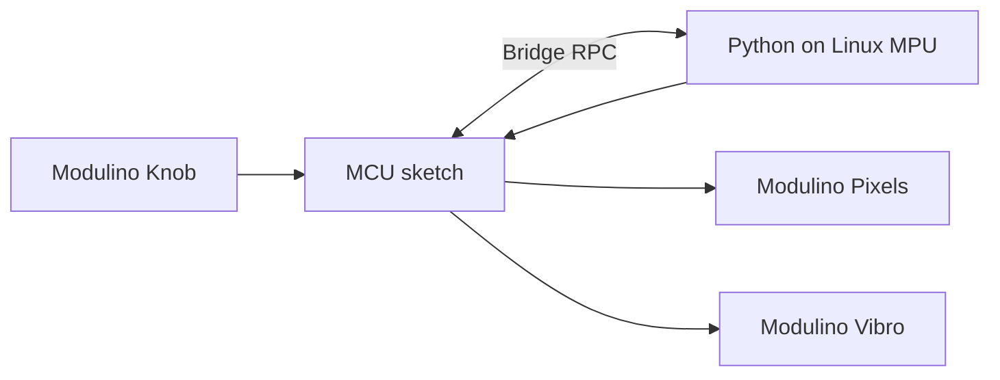

# QC UNO Q Workshop 104: Safe Cracker

As part of this workshop, attendees will build a seven-stage safe-cracking game with the Arduino UNO Q and Modulinos.

The game is intentionally small:

- Turn the Knob Modulino like a safe dial. The Vibro ticks longer as you get closer to the secret number.
- Hold still on the number and the tumbler falls. Each stage you unlock lights one of the seven Pixels green.
- Every stage is harder than the last: a bigger dial, a smaller sweet spot, shorter hints, longer holds, a time limit, and finally a three-number combination.
- The MCU reads the knob and drives the Pixels and Vibro Modulino.
- The Linux MPU runs the game rules in Python, reads the knob over Bridge, and sends display and haptic commands back to the MCU.

> [!IMPORTANT]
> To make the most of the workshop, please complete all pre-requisite instructions before arriving.
>
> Downloading code or required software during the session will cause delays and may prevent you from keeping up with the build.

## Session Pre-requisites

1. Install [Arduino App Lab](https://www.arduino.cc/en/software/#app-lab-section).
2. Clone this repository using `git clone https://github.com/aaishikasb/uno-q-workshops.git` in your terminal.

## Hardware Setup (Provided On-site)

### Required Hardware

- Arduino UNO Q
- Modulino Knob
- Modulino Pixels
- Modulino Vibro
- 3 Qwiic cables
- USB C Cable

### Wiring

Chain the Modulinos with Qwiic, in this order:

```text
UNO Q Qwiic -> Modulino Knob -> Modulino Pixels -> Modulino Vibro
```

After connecting all the Modulinos, connect the UNO Q to your computer with USB-C.

### App Lab Setup

1. Open Arduino App Lab.
2. Select your UNO Q board.
3. If the `Updates` modal pops up, **DO NOT** proceed with updating board firmware.
4. Open **My Apps**.
5. Import or upload the `.zip` file in this repository.
6. Open the imported `UNO Q Safe Cracker` app in App Lab.
7. Confirm the files are present:
   - `app.yaml`
   - `python/main.py`
   - `python/lock_game.py`
   - `sketch/sketch.ino`
   - `sketch/sketch.yaml`
8. Click `Run` on the top-right corner.

App Lab should compile and flash the MCU sketch, then start the Python runtime on the UNO Q Linux side.
The Vibro should pulse once during startup and the first Pixel should glow amber. The console should print `MCU OK. Knob reads 0.`

## How To Play

| Action | Result |
| --- | --- |
| Turn the Knob | Ticks get longer as you approach the number |
| Hold still on the number | A long buzz, then the tumbler falls |
| Press the Knob | Restart the current stage with a new number |
| Hold the Knob for 3 seconds | Start a new game |

The Pixels show your progress:

| Pixels | Meaning |
| --- | --- |
| Green | Stages unlocked |
| Blinking amber | The stage you are cracking |
| All red | Time ran out; the stage reshuffles |
| Rainbow | The safe is open |

### The Seven Stages

The dial is a ring, so turning past the end wraps around. The timer starts on your first turn.

| Stage | Dial steps | Sweet spot (± steps) | Hold | Hint range | Time limit | Numbers |
| --- | --- | --- | --- | --- | --- | --- |
| 1 | 24 | 3 | 0.5 s | 12 | none | 1 |
| 2 | 32 | 2 | 0.7 s | 12 | none | 1 |
| 3 | 40 | 2 | 0.9 s | 12 | 45 s | 1 |
| 4 | 48 | 1 | 0.9 s | 10 | 45 s | 2 |
| 5 | 56 | 1 | 1.1 s | 8 | 50 s | 2 |
| 6 | 64 | 1 | 1.2 s | 6 | 55 s | 3 |
| 7 | 72 | 1 | 1.5 s | 5 | 60 s | 3 |

The hint range is how far away from the number you start to feel ticks. Outside it, the Vibro stays silent. Tune any stage by editing `STAGES` in `python/lock_game.py`.

## How The Demo Works



- MCU sketch samples the knob in `loop()` and exposes the latest `read_knob()` / `read_pressed()` values.
- Python polls those methods and feeds each reading to the game rules in `lock_game.py`.
- The game rules work out how close the dial is to the secret number, whether the tumbler has fallen, and whether time ran out.
- Python calls `tick(ms)`, `pulse(kind)`, and `show_stage(cleared, blink)` on the MCU.
- The MCU updates the physical Pixels and Vibro.

## Troubleshooting

On startup the Python app checks the MCU and prints one of these:

| Console message | Meaning |
| --- | --- |
| `MCU OK. Knob reads 0.` | Bridge and sampling work |
| `no answer from the MCU sketch over Bridge` | The sketch did not compile or flash. Check the App Lab console for build errors |
| `its loop() is not sampling the knob` | The MCU is up but the knob is not responding |

If the knob reads nothing:

- Check that every Modulino's power LED is lit and that the Qwiic cables are fully seated.
- Swap one Qwiic cable or Modulino at a time to isolate a faulty one.
- Power-cycle the UNO Q.
- Do not accept the board firmware update during the workshop.

## Run The Rule Tests

The game rules do not need hardware:

```text
python3 -B 104-safe-cracker/test_safe_cracker.py
```

## Files

- `workshop-app/`: App Lab project source
- `workshop-app.zip`: importable App Lab file
- `test_safe_cracker.py`: tests for the game rules

## Sources

- Arduino UNO Q hardware docs: https://docs.arduino.cc/hardware/uno-q
- Arduino Bridge guide: https://docs.arduino.cc/software/app-lab/bridge/get-started-with-bridge
- Arduino Bridge API: https://docs.arduino.cc/software/app-lab/bridge/bridge-api
- Arduino App structure: https://docs.arduino.cc/software/app-lab/apps/about-apps
- Arduino Modulino library: https://docs.arduino.cc/libraries/arduino_modulino
