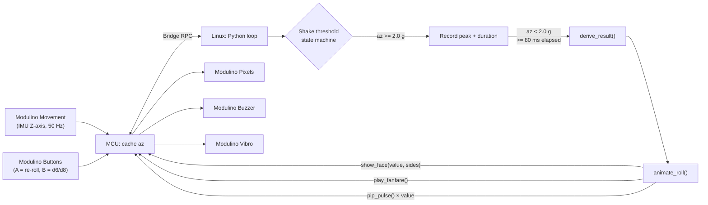

# QC UNO Q Workshop 104: Shake Dice

Build a physical die that rolls itself. Shake the Arduino UNO Q and the IMU Z-axis detects the impact — acceleration peak and shake duration combine to produce a result. Pixels display the die face, the Buzzer plays a fanfare, and the Vibro pulses once per pip. You will learn how IMU acceleration sampling works, how to detect gesture onset and release using a threshold state machine, and how to derive a varied-but-deterministic result from physical input.

## Session Prerequisites

1. Install [Arduino App Lab](https://www.arduino.cc/en/software/#app-lab-section).
2. Clone this repository using `git clone https://github.com/aaishikasb/uno-q-workshops.git` in your terminal.

## Hardware Setup (Provided On-site)

### Required Hardware

- Arduino UNO Q
- Modulino Movement (LSM6DSOX)
- Modulino Pixels
- Modulino Buzzer
- Modulino Vibro
- Modulino Buttons
- 5 Qwiic cables
- USB-C cable

### Wiring

Chain the Modulinos with Qwiic in this order:

```text
UNO Q Qwiic -> Modulino Movement -> Modulino Pixels -> Modulino Buzzer -> Modulino Vibro -> Modulino Buttons
```

> [!NOTE]
> Modulinos on UNO Q can behave differently depending on the order they are connected. Use the chain above to match the tested configuration.

Hold the board flat in your palm during a roll so the Z-axis (perpendicular to the board surface) takes the full impact of the shake.

After connecting all the Modulinos, connect the UNO Q to your computer with USB-C.

## App Lab Setup

1. Open Arduino App Lab.
2. Select your UNO Q board.
3. If the `Updates` modal pops up, **DO NOT** proceed with updating board firmware.
4. Open **My Apps**.
5. Import or upload the `.zip` file in this repository.
6. Open the imported `UNO Q Shake Dice` app in App Lab.
7. Confirm the files are present:
   - `app.yaml`
   - `python/main.py`
   - `sketch/sketch.ino`
   - `sketch/sketch.yaml`
8. Click `Run` on the top-right corner.

App Lab will compile and flash the MCU sketch, then start the Python runtime on the UNO Q Linux side. A short haptic pulse on startup confirms the hardware is ready.

## How The Demo Works



- The MCU samples the IMU Z-axis at 50 Hz and exposes `read_az()` over Bridge.
- Python detects when acceleration exceeds 2.0 g (shake start) and drops back below it (shake end), requiring at least 80 ms to confirm a valid roll.
- Result: `(peak_az_int + shake_duration_ms) % sides + 1` — spreading results across the face range across different shake styles.
- Button A re-rolls without shaking; Button B toggles between d6 and d8 mode.

## Files

- `workshop-app/`: App Lab project source
- `workshop-app/python/main.py`: shake detection, result derivation, and animation sequencing
- `workshop-app/sketch/sketch.ino`: IMU read, Pixel face patterns, Buzzer fanfare, and Vibro pip pulse
- `workshop-app.zip`: importable App Lab file

## Sources

- Arduino UNO Q hardware docs: https://docs.arduino.cc/hardware/uno-q
- Arduino Bridge guide: https://docs.arduino.cc/software/app-lab/bridge/get-started-with-bridge
- Arduino Bridge API: https://docs.arduino.cc/software/app-lab/bridge/bridge-api
- Arduino App structure: https://docs.arduino.cc/software/app-lab/apps/about-apps
- Arduino Modulino library: https://docs.arduino.cc/libraries/arduino_modulino
