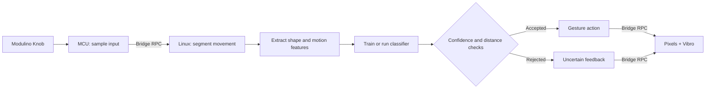

# QC UNO Q Workshop 2: Gesture Dial

As part of this workshop, attendees will turn the `101-Haptic Dial` into a personal edge-AI interface that learns physical gestures.

The app interacts in the following manner:

- The MCU samples the Knob Modulino and drives the Pixels and Vibro Modulinos.
- The Linux MPU turns recent knob movement into fixed-length features.
- Attendees record examples of three gestures and train a small classifier locally.
- The trained model predicts new gestures and reports its confidence through light and haptic feedback.

All inference is local and does not depend on internet connectivity!

> [!IMPORTANT]
> This is a 201-level workshop. Attendees should already be comfortable running an App Lab project and understand the MCU, MPU, and Bridge roles introduced in `101: Haptic Dial`.
>
> Complete the software prerequisites before arriving. Downloading App Lab or board software during the session will cause delays and may prevent you from keeping up with the build.

## Session Prerequisites

1. Complete or review [`101: Haptic Dial`](../101-haptic-dial/).
2. Install [Arduino App Lab](https://www.arduino.cc/en/software/#app-lab-section).
3. Clone this repository using `git clone https://github.com/aaishikasb/uno-q-workshops.git` in your terminal.

## Hardware Setup (Provided On-site)

### Required Hardware

- Arduino UNO Q
- Modulino Knob
- Modulino Pixels
- Modulino Vibro
- 3 Qwiic cables
- USB-C cable

### Wiring

Chain the Modulinos with Qwiic:

```text
UNO Q Qwiic -> Modulino Knob -> Modulino Pixels -> Modulino Vibro
```

The order is not important for I2C, but using the same order makes debugging easier.

After connecting all Modulinos, connect the UNO Q to your computer with USB-C.

## App Lab Setup

1. Open Arduino App Lab.
2. Select your UNO Q board.
3. If the `Updates` modal appears, **DO NOT** update the board firmware during the workshop.
4. Open **My Apps**.
5. Import `workshop-app.zip` from this directory.
6. Open the imported `UNO Q Gesture Dial` app.
7. Confirm these files are present:
   - `app.yaml`
   - `python/main.py`
   - `python/gesture_model.py`
   - `sketch/sketch.ino`
   - `sketch/sketch.yaml`
8. Click `Run` in the top-right corner.
9. Keep the App Lab output panel visible. It tells you which gesture to record and whether an example was accepted.

App Lab compiles and flashes the MCU sketch, then starts the Python runtime on the UNO Q Linux side. The Vibro pulses once during startup.

## Train Your Dial

The first run collects five examples of each gesture in this order:

1. `flick_left`: turn quickly to the left and stop.
2. `flick_right`: turn quickly to the right and stop.
3. `wiggle`: turn right, then left, then return toward the starting position.

For every example:

1. Check the App Lab output for the requested gesture.
2. Press and release the knob.
3. When all eight Pixels turn white, immediately perform the gesture.
4. Stop moving and wait for the short confirmation pulse.

The capture window lasts 1.4 seconds. If there is not enough movement, the Pixels turn amber and the app asks you to retry the same example.

Training colors show the current label and progress:

| Color | Meaning |
| --- | --- |
| Pink | Record `flick_left` examples |
| Green | Record `flick_right` examples |
| Purple | Record `wiggle` examples or fit the model |
| White | Recording is active |
| Amber | Example or prediction was uncertain |
| Red | The example could not be processed |
| Blue | The trained dial is live |

The number of colored Pixels during training shows how many examples for the current label have been accepted.

## Use The Trained Dial

After the fifteenth example, the Linux application trains and saves the model, the Pixels turn blue, and the dial enters live inference mode.

Perform any trained gesture without pressing the knob first. When motion stops:

- Pink indicates `flick_left`.
- Green indicates `flick_right`.
- Purple indicates `wiggle`.
- Amber means the best prediction was rejected as uncertain or unlike the training data.
- More lit Pixels indicate higher confidence.
- A longer haptic pulse accompanies a more confident accepted prediction.

Watch the App Lab output to see the predicted label, confidence, and distance to every learned gesture.

Hold the knob down for three seconds to erase the saved model and repeat training.

## How The Demo Works



### MCU Responsibilities

- Read the knob position and button state.
- Render training, recording, prediction, and error states on the Pixels.
- Generate immediate haptic feedback.
- Expose hardware services to Linux through Bridge.

### Linux MPU Responsibilities

- Poll the knob at a fixed interval and create time-series windows.
- Detect when a live gesture starts and ends.
- Trim inactivity and resample each gesture to a consistent shape.
- Add direction, reversal, duration, and peak-motion features.
- Standardize the features and learn one centroid per gesture class.
- Reject predictions that have low confidence or are far outside the training examples.
- Save the model to `data/gesture_model.json`.

## The Model

This workshop uses a nearest-centroid classifier implemented with the Python standard library. Each gesture becomes a numeric feature vector. Training calculates the average vector, or centroid, for each label. Inference chooses the closest centroid.

The intentionally small model makes the complete edge-AI loop visible:

```text
collect -> label -> represent -> train -> infer -> evaluate -> act
```

Some gestures could be implemented with hand-written thresholds. The classifier becomes useful when the motion shape, direction changes, and individual interaction style matter together.

## Suggested Experiments

- Record very consistent examples, retrain, and compare confidence.
- Train with intentionally varied speeds and amplitudes.
- Swap dials with a partner and test how well each personal model generalizes.
- Change the `0.58` confidence threshold in `gesture_model.py`.
- Add a fourth gesture and assign it a new Pixel color.
- Map accepted gestures to control modes instead of displaying their labels.

## Troubleshooting

### The app keeps rejecting training examples

- Start moving as soon as the Pixels turn white.
- Make the gesture large enough to produce at least six knob steps.
- Finish within the 1.4-second recording window.

### Live gestures are frequently uncertain

- Make the gesture similar to your training examples.
- Use App Lab output to compare class distances.
- Hold the knob for three seconds and retrain with more distinct motions.

### The app skips training when restarted

The trained model is intentionally persistent. Hold the knob for three seconds while the app is live to delete it and begin again.

### The wrong gesture is predicted confidently

The classes may contain examples with overlapping shapes. Retrain with more distinct movements or inspect the feature and distance code in `python/gesture_model.py`.

## Files

- `workshop-app/`: App Lab project source
- `workshop-app/python/main.py`: interaction, capture, and inference state machine
- `workshop-app/python/gesture_model.py`: feature extraction, training, prediction, and persistence
- `workshop-app/sketch/sketch.ino`: MCU hardware services and feedback
- `workshop-app.zip`: importable App Lab project

## Sources

- Arduino UNO Q hardware docs: https://docs.arduino.cc/hardware/uno-q
- Arduino App Lab docs: https://docs.arduino.cc/software/app-lab/
- Arduino Bridge guide: https://docs.arduino.cc/software/app-lab/bridge/get-started-with-bridge
- Arduino Bridge API: https://docs.arduino.cc/software/app-lab/bridge/bridge-api
- Arduino App structure: https://docs.arduino.cc/software/app-lab/apps/about-apps
- Arduino Modulino library: https://docs.arduino.cc/libraries/arduino_modulino
