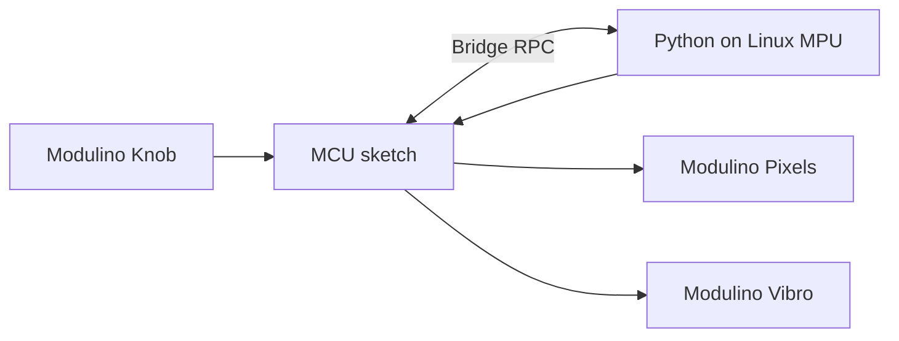

# QC UNO Q Workshop 1: Haptic Dial

As part of this workshop, attendees will build a physical interface with the Arduino UNO Q and Modulinos.

The demo is intentionally small:

- Turn the Knob Modulino to change a level from 0 to 100.
- The MCU reads the knob and drives the Pixels and Vibro Modulino.
- The Linux MPU runs a Python loop that reads the knob over Bridge, decides what the level means, and sends display and haptic commands back to the MCU.

> [!IMPORTANT]
> To make the most of the workshop, please complete all pre-requisite instructions before arriving.
> 
> Downloading code or required software during the session will cause delays and may prevent you from keeping up with the build.

## Session Pre-requisites

1. Install [Arduino App Lab](https://www.arduino.cc/en/software/#app-lab-section).
2. Clone this repository using `git clone https://github.com/aaishikasb/uno-q-workshop-1.git` in your terminal.

## Hardware Setup (On-site)

### Required Hardware

- Arduino UNO Q
- Modulino Knob
- Modulino Pixels
- Modulino Vibro
- 3 Qwiic cables
- USB C Cable

### Wiring

Chain the Modulinos with Qwiic:

```text
UNO Q Qwiic -> Modulino Knob -> Modulino Pixels -> Modulino Vibro
```

The order is not important for I2C, but using the same order makes debugging easier.

> [!NOTE]
> If you use two or more Modulinos of the same type, you’ll need to address each one separately and map it to its physical position.
> 
> In this demo, all three Modulinos are different types, so their order is inconsequential.

After connecting all the Modulinos, connect the UNO Q to your computer with USB-C.

### App Lab Setup

1. Open Arduino App Lab.
2. Select your UNO Q board.
3. If the `Updates` modal pops up, **DO NOT** proceed with updating board firmware.
4. Open **My Apps**.
5. Import or upload the `.zip` file in this repository.
6. Open the imported `workshop-app.zip` file in App Lab.
7. Confirm the files are present:
   - `app.yaml`
   - `python/main.py`
   - `sketch/sketch.ino`
   - `sketch/sketch.yaml`
8. Click `Run` on the top-right corner.

App Lab should compile and flash the MCU sketch, then start the Python runtime on the UNO Q Linux side.

## How The Demo Works



- MCU sketch reads the knob and exposes `read_knob()` / `read_pressed()`.
- Python polls those methods, clamps the knob value to 0-100, and decides when something changed.
- Python calls `show_level(level)` and `pulse_vibro(level)` on the MCU.
- The MCU updates the physical Pixels and Vibro.

## Files

- `workshop-app/`: App Lab project source
- `workshop-app.zip`: importable App Lab file

## Sources

- Arduino UNO Q hardware docs: https://docs.arduino.cc/hardware/uno-q
- Arduino Bridge guide: https://docs.arduino.cc/software/app-lab/bridge/get-started-with-bridge
- Arduino Bridge API: https://docs.arduino.cc/software/app-lab/bridge/bridge-api
- Arduino App structure: https://docs.arduino.cc/software/app-lab/apps/about-apps
- Arduino Modulino library: https://docs.arduino.cc/libraries/arduino_modulino
